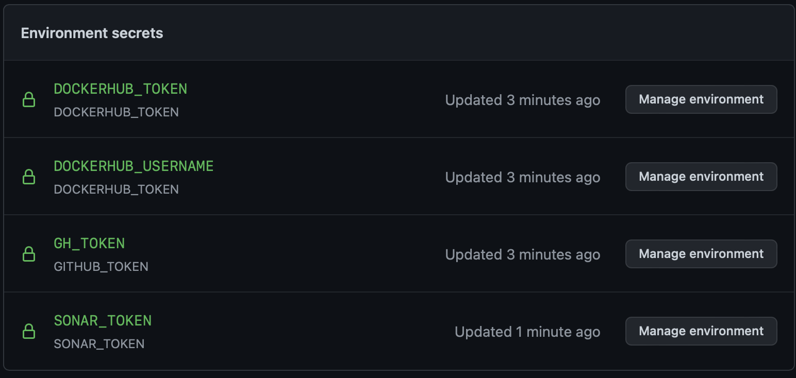

# Devops S8 2022 CPE Lyon
*Ayant fait le TP à distance à cause du covid, je me suis fais aider et conseiller par mes camarades sur place*


# GIT - CI/CD
## First steps into the CI world

Test de l'application
```
cd APIJava/simple-api
```
```
mvn clean verify
```

On créé le repo git à partir du TP 1 comme ceci 
```
git init  
git add .
git commit
```
VIM s'ouvre pour que l'on puisse écrire notre message de commit. On quitte VIM avec *esc :x* pour enregistrer
```
git branch -M main
git remote add origin https://github.com/mootea/devopsS82022CPELyon
git push -u origin main

```

Pour la gestion des workflows GitHub 
```
mkdir .github
mkdir .github/workflows
cd .github/workflows
touch main.yml
```

Fichier main.yml :
```
name:  CI  devops  2022  CPE
on:
  # tests branches
  push:
    branches:
      - main
      - develop
  pull_request:
jobs:
  test-backend:
    runs-on:  MacOS 12.2
    steps:
      #checkout your github code using actions/checkout@v2.3.3  
      - uses: actions/checkout@v2.3.3
      - name:  Set  up  JDK  11
        uses: actions/setup-java@v2
        with:
          distribution: 'zulu'
          java-version: '11'
      #Run and verification with maven of pom.xml location
      - name:  Build  and  test  with  Maven
        run:  mvn -B verify --file APIJava/simple-api/pom.xml

```

## First steps into the CD world

Pour ajouter des secrets à Github Actions -> Dans notre projet sur GitHub : *Settings/Secrets/Actions*. <br>
On crée un environnement de secrets DOCKERHUB_TOKEN.<br>

On crée un Docker Token sur https://hub.docker.com/settings/security?generateToken=true dans "account settings > Security" puis on l'ajoute à un secret sur GitHub.<br>

On crée un autre secret pour le nom utilisateur. <br>

Ensuite, on ajoute la construction et la publication des images Docker dans les actions (pour le fichier main.yml précédemment créé)
```
  build-and-push-docker-image:
    needs: test-backend
    # run only when code is compiling and tests are passing
    runs-on: MacOS 12.2
    # steps to perform in job
    steps:
      - name: Login to DockerHub
        run: docker login -u ${{ secrets.DOCKERHUB_USERNAME }} -p ${{secrets.DOCKERHUB_TOKEN}}
      - name: Checkout code
        uses: actions/checkout@v2
      - name: Build image and push backend
        uses: docker/build-push-action@v2
        with:
        # relative path to the place where source code with Dockerfile is located
          context: ./APIJava/simple-api
        # Note: tags has to be all lower-case
          tags: ${{secrets.DOCKERHUB_USERNAME}}/APIJava
          push: ${{ github.ref == 'refs/heads/main' }}
      - name: Build image and push database
        uses: docker/build-push-action@v2
        with:
          context: ./postgres
          tags: ${{secrets.DOCKERHUB_USERNAME}}/postgres
          push: ${{ github.ref == 'refs/heads/main' }}
      - name: Build image and push httpd
        uses: docker/build-push-action@v2
        with:
          context: ./http_basic
          tags: ${{secrets.DOCKERHUB_USERNAME}}/http_basic
          push: ${{ github.ref == 'refs/heads/main' }}
```

On doit forcément se connecter à Docker, d'où l'étape "login to dockerhub"

```
docker login
```
On ajoute tout ça au ".github/workflows/main.yml"

## Setup Quality Gate

https://sonarcloud.io/project/information?id=mootea_devopsS82022CPELyon
On génère notre token dans "account settings > Security" puis on va l'ajouter à un secret GitHub.<br>

On crée un environnement de secrets DOCKERHUB_TOKEN et on ajoute le secret token.<br>

On génère ensuite notre token GitHub dans "Settings > Developer settings > Personal access tokens" et on autorise tout pour (ici) 30 jours.<br>

On crée un environnement de secrets GITHUB_TOKEN et on ajoute le secret token.<br>

```
  test-backend:
    runs-on:  MacOS 12.2
    steps:
      #checkout your github code using actions/checkout@v2.3.3  
      - uses: actions/checkout@v2.3.3
      #do the same with another action (actions/setup-java@v2) that enable to setup jdk 11  
      - name:  Set  up  JDK  11
        uses: actions/setup-java@v2
        with:
          distribution: 'zulu'
          java-version: '11'
      #finally build your app with the latest command  
      - name:  Build  and  test  with  Maven
        run:  mvn -B verify sonar:sonar -Dsonar.projectKey=mootea_devopsS82022CPELyon -Dsonar.organization=mootea -Dsonar.host.url=https://sonarcloud.io -Dsonar.login=${{secrets.SONAR_TOKEN}} --file APIJava/simple-api-main/simple-api/pom.xml
        env:
          GITHUB_TOKEN: ${{ secrets.GH_TOKEN }} 
          SONAR_TOKEN: ${{ secrets.SONAR_TOKEN }}
```

On ajoute tout ça au ".github/workflows/main.yml"

## Split pipeline

Pour éviter de refaire tous les test à chaque push on peut fixer le working directory de test-backend :
```
  env:
    GITHUB_TOKEN: ${{ secrets.GH_TOKEN }}
    SONAR_TOKEN: ${{ secrets.SONAR_TOKEN }}
    working-directory: ./APIJava/simple-api-main/simple-api
```
On ajoute tout ça au ".github/workflows/main.yml"

# Annexe
Secrets 

